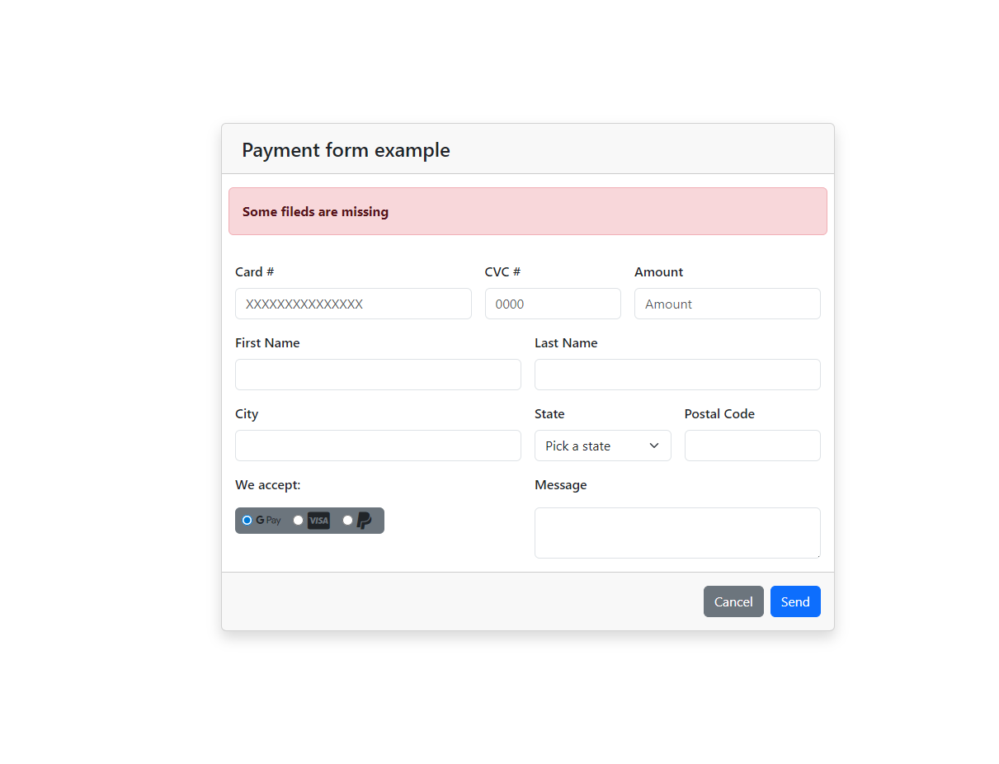
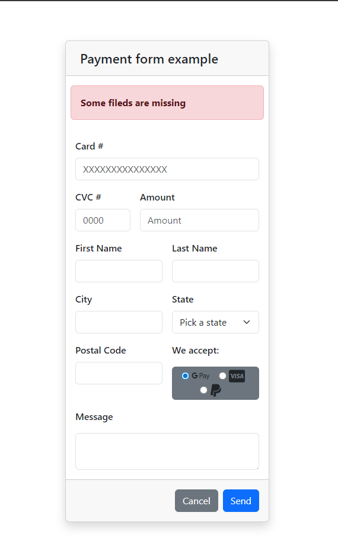

# 💳 Payment Form Interface - Form Practice

Este proyecto es una interfaz de formulario de pago responsiva, construida como ejercicio de aprendizaje, el manejo de layouts complejos y la semántica de formularios web.

## 📸 Demostración Visual

| Vista de Escritorio (PC) | Vista Móvil (Smartphone) |
| :---: | :---: |
|  |  |

## 🛠️ Tecnologías utilizadas

* **HTML5:** Estructura y semántica.
* **Bootstrap 5.3:** Sistema de rejilla (Grid), utilidades de espaciado y componentes.
* **FontAwesome 6.5:** Iconografía de marcas de pago 
